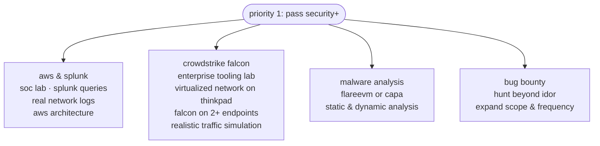

# Luigi Fernandez - cs @ gsu

## about me

i'm a cs student specializing in cybersecurity. learned a wide variety of network & security tools. my favorite tool is burp suite. i love monster hunter freedom unite & xenoblade

## future plans

